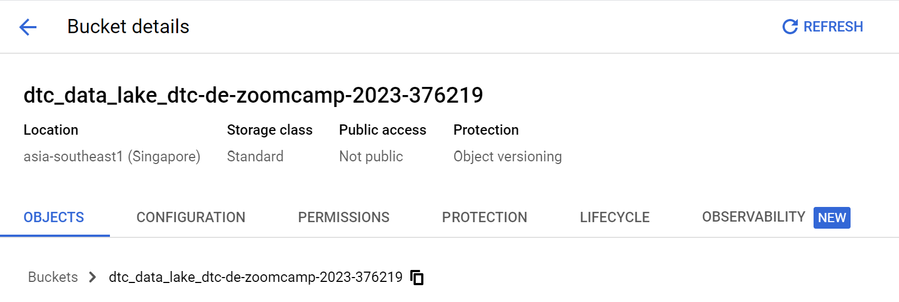

## [Additional] Question 7. Creating Resources
After updating the main.tf and variable.tf files run:
```
terraform apply
```

Paste the output of this command into the homework submission form.

### Answer
Result
```
Terraform used the selected providers to generate the following execution
plan. Resource actions are indicated with the following symbols:
  + create

Terraform will perform the following actions:

  # google_bigquery_dataset.dataset will be created
  + resource "google_bigquery_dataset" "dataset" {
      + creation_time              = (known after apply)
      + dataset_id                 = "trips_data_all"
      + delete_contents_on_destroy = false
      + etag                       = (known after apply)
      + id                         = (known after apply)
      + labels                     = (known after apply)
      + last_modified_time         = (known after apply)
      + location                   = "asia-southeast1"
      + project                    = "dtc-de-zoomcamp-2023-376219"
      + self_link                  = (known after apply)

      + access {
          + domain         = (known after apply)
          + group_by_email = (known after apply)
          + role           = (known after apply)
          + special_group  = (known after apply)
          + user_by_email  = (known after apply)

          + dataset {
              + target_types = (known after apply)

              + dataset {
                  + dataset_id = (known after apply)
                  + project_id = (known after apply)
                }
            }

          + routine {
              + dataset_id = (known after apply)
              + project_id = (known after apply)
              + routine_id = (known after apply)
            }

          + view {
              + dataset_id = (known after apply)
              + project_id = (known after apply)
              + table_id   = (known after apply)
            }
        }
    }

  # google_storage_bucket.data-lake-bucket will be created
  + resource "google_storage_bucket" "data-lake-bucket" {
      + force_destroy               = true
      + id                          = (known after apply)
      + location                    = "ASIA-SOUTHEAST1"
      + name                        = "dtc_data_lake_dtc-de-zoomcamp-2023-376219"
      + project                     = (known after apply)
      + public_access_prevention    = (known after apply)
      + self_link                   = (known after apply)
      + storage_class               = "STANDARD"
      + uniform_bucket_level_access = true
      + url                         = (known after apply)

      + lifecycle_rule {
          + action {
              + type = "Delete"
            }

          + condition {
              + age                   = 30
              + matches_prefix        = []
              + matches_storage_class = []
              + matches_suffix        = []
              + with_state            = (known after apply)
            }
        }

      + versioning {
          + enabled = true
        }

      + website {
          + main_page_suffix = (known after apply)
          + not_found_page   = (known after apply)
        }
    }

Plan: 2 to add, 0 to change, 0 to destroy.

Do you want to perform these actions?
  Terraform will perform the actions described above.
  Only 'yes' will be accepted to approve.

  Enter a value: yes

google_bigquery_dataset.dataset: Creating...
google_storage_bucket.data-lake-bucket: Creating...
google_bigquery_dataset.dataset: Creation complete after 3s [id=projects/dtc-de-zoomcamp-2023-376219/datasets/trips_data_all]
google_storage_bucket.data-lake-bucket: Creation complete after 4s [id=dtc_data_lake_dtc-de-zoomcamp-2023-376219]
```

The terraform config files can be found [here](./terraform).

The created bucket and big-query table: 

.
.