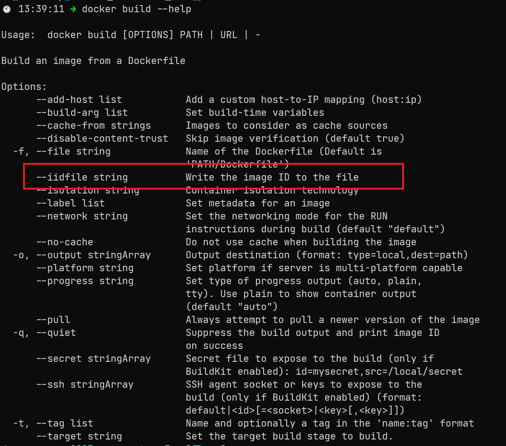
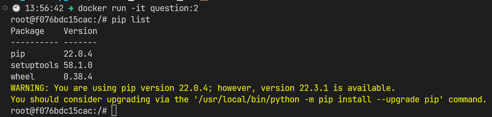

# Week 1 Homework Answer

## Question 1. Knowing docker tags
Run the command to get information on Docker

```
docker --help
```

Now run the command to get help on the "docker build" command

Which tag has the following text? - Write the image ID to the file

### Answer
**iidfile**

_Explanation_


## Question 2. Understanding docker first run
Run docker with the python:3.9 image in an interactive mode and the entrypoint of bash. Now check the python modules that are installed ( use pip list). How many python packages/modules are installed?

1
6
3
7

### Answer
**3**

_Explanation_
1. Create a Dockerfile using python:3.9 image and set the entrypoint as "bash" 
```
FROM python:3.9

ENTRYPOINT ["bash"]
```

2. Build docker image from the Dockerfile definition `docker build -t question:2 .`

3. Enter into the docker via interactive mode and list the number of installed package



## Question 3. Count records
How many taxi trips were totally made on January 15?
Tip: started and finished on 2019-01-15.

Remember that lpep_pickup_datetime and lpep_dropoff_datetime columns are in the format timestamp (date and hour+min+sec) and not in date.

### Answer
20689
20530
17630
21090

_Explanation_

## Question 4. Largest trip for each day
Which was the day with the largest trip distance Use the pick up time for your calculations.

### Answer
2019-01-18
2019-01-28
2019-01-15
2019-01-10

_Explanation_

## Question 5. The number of passengers
In 2019-01-01 how many trips had 2 and 3 passengers?

### Answer
2: 1282 ; 3: 266
2: 1532 ; 3: 126
2: 1282 ; 3: 254
2: 1282 ; 3: 274

_Explanation_

## Question 6. Largest tip
For the passengers picked up in the Astoria Zone which was the drop off zone that had the largest tip? We want the name of the zone, not the id.

Note: it's not a typo, it's tip , not trip

### Answer
Central Park
Jamaica
South Ozone Park
Long Island City/Queens Plaza

_Explanation_

## [Additional] Question 7. Creating Resources
After updating the main.tf and variable.tf files run:
```
terraform apply
```

Paste the output of this command into the homework submission form.

### Answer
