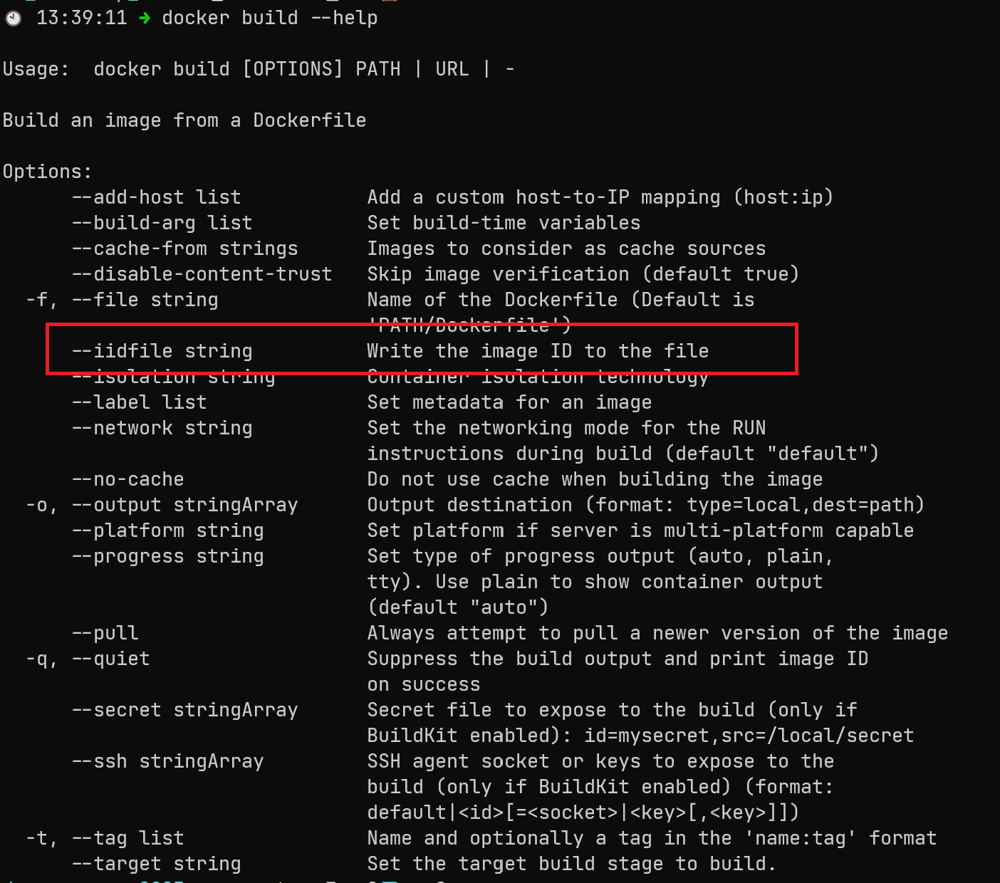
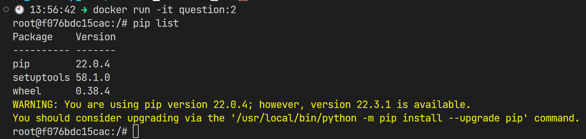
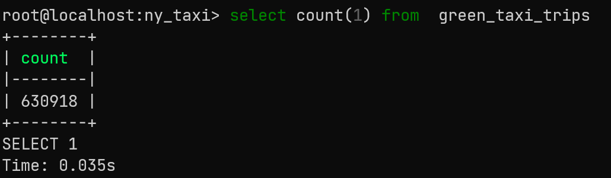
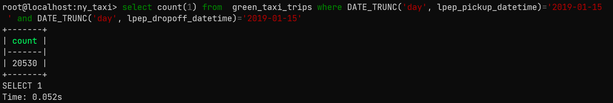
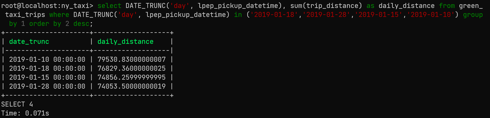
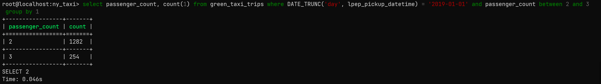
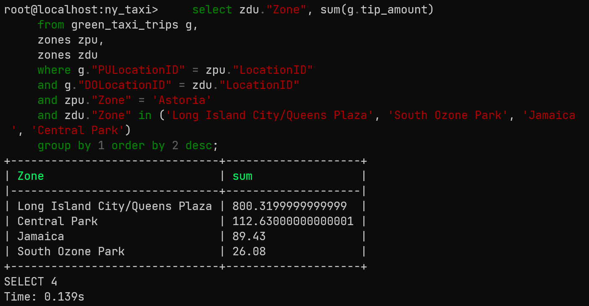

# Week 1 Homework Answer

## Question 1. Knowing docker tags
Run the command to get information on Docker

```
docker --help
```

Now run the command to get help on the "docker build" command

Which tag has the following text? - Write the image ID to the file

### Answer
**iidfile**

_Explanation_


## Question 2. Understanding docker first run
Run docker with the python:3.9 image in an interactive mode and the entrypoint of bash. Now check the python modules that are installed ( use pip list). How many python packages/modules are installed?

### Answer
**3**

_Explanation_
1. Create a Dockerfile using python:3.9 image and set the entrypoint as "bash" 
```
FROM python:3.9
ENTRYPOINT ["bash"]
```

2. Build docker image from the Dockerfile definition `docker build -t question:2 .`

3. Enter into the docker via interactive mode and list the number of installed package with `pip list` command.



## Question 3. Count records
How many taxi trips were totally made on January 15?
Tip: started and finished on 2019-01-15.

Remember that lpep_pickup_datetime and lpep_dropoff_datetime columns are in the format timestamp (date and hour+min+sec) and not in date.

### Answer
**20530**

_Explanation_
- Before, we ingest `green_tripdata_2019-01` to postgres. Let's inspect the data.
```
wget https://github.com/DataTalksClub/nyc-tlc-data/releases/download/green/green_tripdata_2019-01.csv.gz
gzip -dv green_tripdata_2019-01.csv.gz

```
- Then modify some code in `ingest_data.py`, in `green_tripdata_2019-01` there are columns with different name from the `yellow_tripdata_2021-01.csv`.

Update the URL into : 
```
URL="https://github.com/DataTalksClub/nyc-tlc-data/releases/download/green/green_tripdata_2019-01.csv.gz"
```

- Run the ingestion script

```
python ingest_data.py --user=root \
    --password=root \
    --host=postgres-db \
    --port=5432 \
    --db=ny_taxi \
    --table_name=green_taxi_trips \
    --url=${URL}
```
- Check currently ingested data on table


- count number of taxi trips were totally started and finished on 2019-01-15.

```
    select count(1) 
    from green_taxi_trips 
    where DATE_TRUNC('day', lpep_pickup_datetime)='2019-01-15' 
    and DATE_TRUNC('day', lpep_dropoff_datetime)='2019-01-15'
```




## Question 4. Largest trip for each day
Which was the day with the largest trip distance? Use the pick up time for your calculations.

### Answer
**2019-01-10**

_Explanation_
- Write a query that sum the trip distance (based on its pick up time) from each date: 2019-01-18, 2019-01-28,2019-01-15, 2019-01-10, sort by the largest distance.

```
    select DATE_TRUNC('day', lpep_pickup_datetime), sum(trip_distance) as daily distance
    from green_taxi_trips
    where DATE_TRUNC('day', lpep_pickup_datetime) in ('2019-01-18','2019-01-28','2019-01-15','2019-01-10')
    group by 1
    order by 2 desc
```



## Question 5. The number of passengers
In 2019-01-01 how many trips had 2 and 3 passengers?

### Answer
**2: 1282 ; 3: 254**

_Explanation_

- write a query that count the number of trips where pickup date = 2019-01-01

```
    select passenger_count, count(1) 
    from green_taxi_trips 
    where DATE_TRUNC('day', lpep_pickup_datetime) = '2019-01-01' 
    and passenger_count between 2 and 3
    group by 1
```




## Question 6. Largest tip
For the passengers picked up in the Astoria Zone which was the drop off zone that had the largest tip? We want the name of the zone, not the id.

Note: it's not a typo, it's tip , not trip

### Answer
***Long Island City/Queens Plaza***

_Explanation_
- run this query

```
    select zdu."Zone", sum(g.tip_amount) 
    from green_taxi_trips g,
    zones zpu, 
    zones zdu 
    where g."PULocationID" = zpu."LocationID" 
    and g."DOLocationID" = zdu."LocationID" 
    and zpu."Zone" = 'Astoria' 
    and zdu."Zone" in ('Long Island City/Queens Plaza', 'South Ozone Park', 'Jamaica', 'Central Park') 
    group by 1 order by 2 desc;
```
