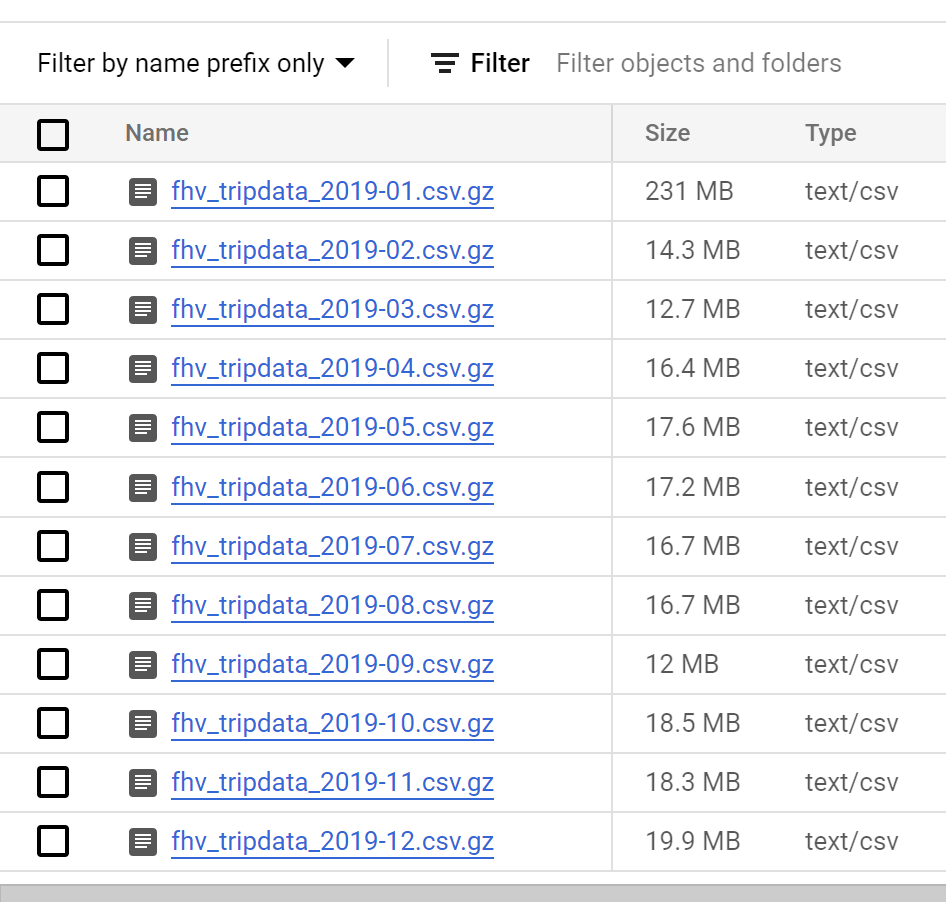
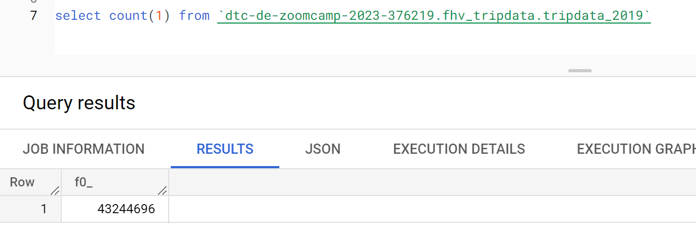
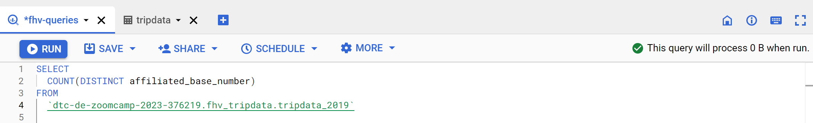
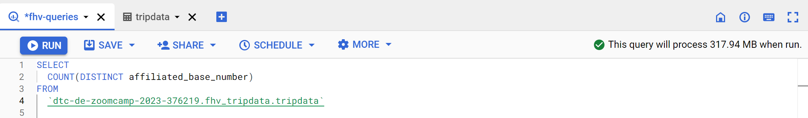
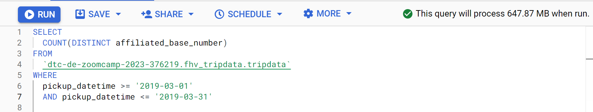
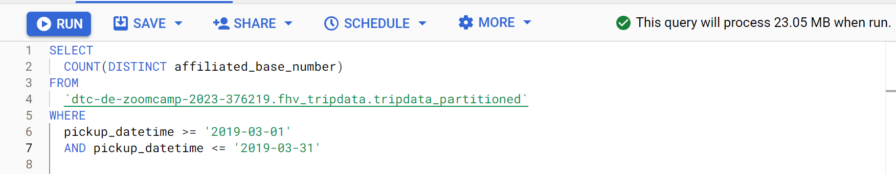

# Week 3 Solution
Important Note:

You can load the data however you would like, but keep the files in .GZ Format. If you are using orchestration such as Airflow or Prefect do not load the data into Big Query using the orchestrator.
Stop with loading the files into a bucket.

NOTE: You can use the CSV option for the GZ files when creating an External Table

SETUP:
Create an external table using the fhv 2019 data.
Create a table in BQ using the fhv 2019 data (do not partition or cluster this table).
Data can be found here: https://github.com/DataTalksClub/nyc-tlc-data/releases/tag/fhv

## Question 1:
What is the count for fhv vehicle records for year 2019?

### Answer
**43,244,696**

_explanation_
- Since there is no modification needed on fhv data github to GCS storage. I created an ingestion script using bash script (the script can be found here). The steps are: 
a) download .gzip data from github to local directory
b) upload to .gzip data from local directory to GCS using gcloud command

```
chmod +x code/q1_ingest_data.sh

```
before running the sh file, make sure that you have already installed gcloud and setup your gcloud user-account.
```
gcloud info
gcloud auth list

# login with this command
gcloud auth login
```

- Once all the fhv dataset is uploaded to GCS


- Let's create table in BQ that load an external table, with this command:
```
CREATE OR REPLACE EXTERNAL TABLE `dtc-de-zoomcamp-2023-376219.fhv_tripdata.tripdata_2019`
OPTIONS (
  format = 'CSV',
  uris = ['gs://fhv_ny_taxi_dtc-de-zoomcamp-2023-376219/fhv_tripdata_2019-*.csv.gz']
);
```

- Run this query to count number of rows
```
SELECT count(1) FROM `dtc-de-zoomcamp-2023-376219.fhv_tripdata.tripdata_2019`
```



## Question 2:
Write a query to count the distinct number of affiliated_base_number for the entire dataset on both the tables.
What is the estimated amount of data that will be read when this query is executed on the External Table and the Table?


### Answer

**0 MB for the External Table and 317.94MB for the BQ Table**

_explanation_
- This problem expects us to compare a query that is executed in a External Table with a BQ Table. Thus, we should create a new BQ table where the data is loaded IN the internal BQ storage.
- I modified `gcs_to_bq.py` file (from week2) to read csv data from local and upload to a BQ table. I skipped the download steps (from GCS to local) because I have already downloaded all the dataset using bash script defined in `q1_ingest_data.sh` file. Please refer to this file: `q1_gcs_to_bq.py`
- Then, run `q1_gcs_to_bq.py` using prefect in local server.

```
prefect config set PREFECT_API_URL="http://127.0.0.1:4200/api"

prefect orion start

prefect deployment build week3/q1_gcs_to_bq.py:etl_parent_flow -n "week-3_gcs-to-bq" \
    --params='{"months": [1,2,3,4,5,6,7,8,9,10,11,12], "year": "2019"}' \
    --apply

prefect agent start -q default

prefect deployment run 'etl-parent-flow/week-3_gcs-to-bq'
```

- Once all the data are loaded into `tripdata_2019` table. Let's write a query to count the distinct number of affiliated_base_number for the entire dataset on both the tables; and compare the estimated amount of data will be read.

```
# SQL for external table 
SELECT
  COUNT(DISTINCT affiliated_base_number)
FROM
  `dtc-de-zoomcamp-2023-376219.fhv_tripdata.tripdata_2019`
```




```
# SQL for BQ table 
SELECT
  COUNT(DISTINCT affiliated_base_number)
FROM
  `dtc-de-zoomcamp-2023-376219.fhv_tripdata.tripdata` 
```



It is shown that we couldn't get an estimated amount of read data from External Table, thus we cannot estimate the cost of the query (refer to this [link](https://cloud.google.com/bigquery/docs/estimate-costs) to estimate the query cost). Hence, query performance for External Tables might be low compared to querying data in a standard BigQuery table. If query speed is a priority, load the data into BigQuery instead of setting up an external data source ([source](https://cloud.google.com/bigquery/docs/external-tables#limitations))

## Question 3:
How many records have both a blank (null) PUlocationID and DOlocationID in the entire dataset?

### Answer
***717,748***

_explanation_
- Run this SQL 

```
SELECT
  COUNT(1)
FROM
  `dtc-de-zoomcamp-2023-376219.fhv_tripdata.tripdata`
WHERE
  PUlocationID IS NULL
  AND DOlocationID IS NULL 
```

## Question 4:
What is the best strategy to optimize the table if query always filter by pickup_datetime and order by affiliated_base_number?

### Answer

**Partition by pickup_datetime Cluster on affiliated_base_number**

## Question 5:
Implement the optimized solution you chose for question 4. Write a query to retrieve the distinct affiliated_base_number between pickup_datetime 03/01/2019 and 03/31/2019 (inclusive).
Use the BQ table you created earlier in your from clause and note the estimated bytes. Now change the table in the from clause to the partitioned table you created for question 4 and note the estimated bytes processed. What are these values? Choose the answer which most closely matches.

### Answer

**647.87 MB for non-partitioned table and 23.06 MB for the partitioned table**

_explanation_

- In this question we are asked to implement optimized solution (chosen from Q4) to a BQ table (`tripdata_partitioned`). Thus, we should create a new partitioned table from `tripdata`.

```
CREATE OR REPLACE TABLE
  `dtc-de-zoomcamp-2023-376219.fhv_tripdata.tripdata_partitioned`
PARTITION BY
  DATE(pickup_datetime)
CLUSTER BY
  affiliated_base_number AS
SELECT
  *
FROM
  `dtc-de-zoomcamp-2023-376219.fhv_tripdata.tripdata`;
```

- Then compare the estimated bytes processed between table `tripdata_partitioned` and tripdata (non-partitioned) for query that retrieve the distinct affiliated_base_number between pickup_datetime 03/01/2019 and 03/31/2019 (inclusive). 





- From the query results, we can see that the query on a non-partitioned table will scan the entire 647.87MB of data, while the partitioned table will scan 23.05MB of data. Partitioning table fully maximizes BigQuery performance and cost when querying over a specific range.

## Question 6:
Where is the data stored in the External Table you created?

### Answer
**GCP Bucket**


## Question 7:
It is best practice in Big Query to always cluster your data:

### Answer
**True**

Clustering can improve the performance of certain types of queries, such as those using filter clauses and queries aggregating data.

## (Not required) Question 8:
A better format to store these files may be parquet. Create a data pipeline to download the gzip files and convert them into parquet. Upload the files to your GCP Bucket and create an External and BQ Table.

Note: Column types for all files used in an External Table must have the same datatype. While an External Table may be created and shown in the side panel in Big Query, this will need to be validated by running a count query on the External Table to check if any errors occur.

### Answer

A data pipeline to download the gzip files and convert them into parquet, see `week3/q8_web_to_bq.py` file.
